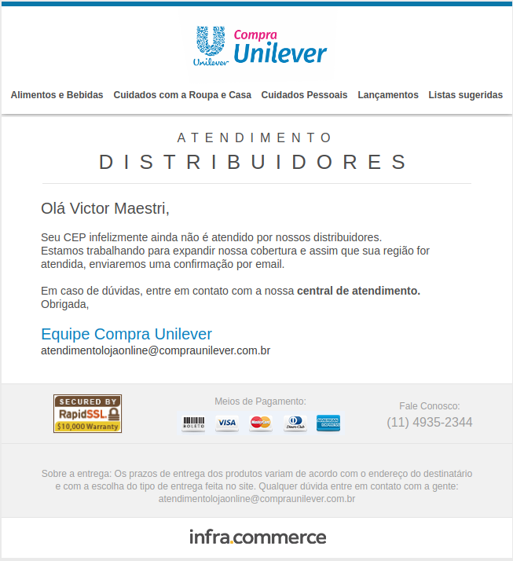
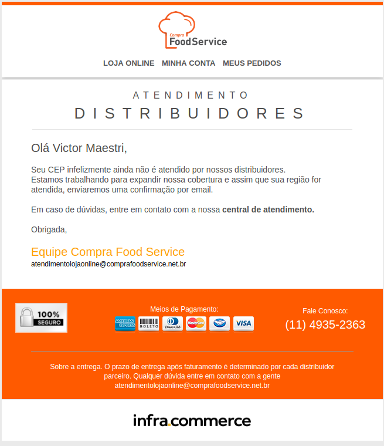
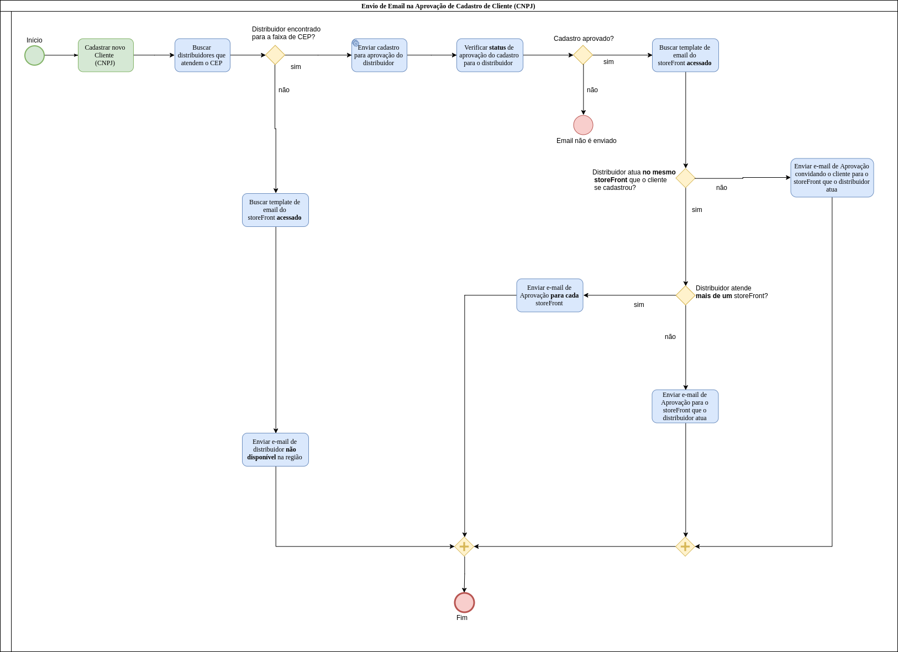

# InfraShop - Middleware B2B

## Sumário
- [Middleware B2B](#middleware-b2b)
- [Atributos Customizáveis](#atributos-customizáveis)
  - [Lista de atributos customizáveis](#lista-de-atributos-customizáveis)
- [Integração de Clientes](#integração-de-clientes)
  - [Notificação do Cadastro de Clientes](#notificação-do-cadastro-de-clientes)
  - [Atualização de Status de Clientes](#atualização-de-status-de-clientes)
  - [E-mails](#e-mails)

### Middleware B2B
Para uma visão geral da integração Middleware B2B no TWiki:
*  https://lab.accurate.com.br/twiki/bin/view/Main/AcecIntegracaoB2B

### Atributos Customizáveis

Nas integrações com os distribuidores é possível customizar a definição de envios de alguns atributos, por exemplo, configurar se um determinado atributo será ou não enviado para um distribuidor ou para todos os distribuidores.

Essa customização é feira na General Parameter `B2B_SELLER_CONFIG`.

Existem dois atributos principais nessa GP: 

*  `globalConfig`: esse bloco contém a configuração global das customizações, ou seja, o que estiver configurado nessa parte será automaticamente replicada para qualquer distribuidor que não sobrescreva a configuração.
*  `sellers`: esse bloco contém configurações por distribuidor, ou seja, o que estiver configurado nesse bloco vai sobrescrever a configuração do bloco global somente para o distribuidor em questão
* **IMPORTANTE:** em atributos que sejam do tipo lista, por exemplo `customer.attributes.attributesToSend` será feito `UNION` dos valores globais e dos valores por distribuidor. Os demais tipos de informação serão sobrescritos.

```json
{   
    "globalConfig": {   
        "customer": {   
            "attributes": {   
                "attributesToSend": [   
                    "RUT"   
                ]  
            }, 
            "address": { 
                "friendlyNm" : false
            } 
        }   
    },   
    "sellers": [   
        {   
           "customer": {
                "attributes": {   
                    "attributesToSend": [   
                        "STATUS"   
                    ]
                },
                "address": { 
                  "friendlyNm" : true 
                } 
            },   
            "warehouseId": 200   
        },
        {   
           "customer": {
                "address": {
                  "friendlyNm" : true 
                } 
            },   
            "warehouseId": 210   
        }
    ]   
}
```
Dado o exemplo acima:
* o distribuidor **200** recebe o `friendlyNm` do endereço, e os atruibutos `RUT` e `STATUS`.
* o distribuidor **210** recebe o `friendlyNm` do endereço, e o atruibuto `RUT`.
* o distribuidor **500** o atruibuto `RUT`, assim como todos os demais.


#### Lista de atributos customizáveis

| ATRIBUTO | VALOR | INTEGRAÇÃO | DESCRIÇÃO |
|---|---|---|---|
| customer.address.friendlyNm | `true` ou `false` | NCC | Controla o envio do campo `friendlyNm` no endereço do cliente. <br/><br/>  Se `globalConfig.customer.address.friendlyNm = false` então consulta o valor em `sellers.customer.address.friendlyNm` para o respectivo distribuidor. <br/><br/> Se `globalConfig.customer.address.friendlyNm = true` então envia o campo preenchido para todos os distribuidores. |
| customer.attributes.attributesToSend | `RUT` | NCC | Controla o envio do atributo do cliente com nome `RUT`, usado por exemplo na UNILEVERCO, para mais detalhes [clique aqui] (https://gitlab.infracommerce.com.br/rodrigo.lisboa/unileverco-doc/blob/master/README.md#cadastro-de-documento-rut) |


### Integração de Clientes

O Middleware B2B realiza dois tipos de integrações de clientes:

*  Notificação do cadastro do cliente: quando o cliente se cadastra ou altera qualquer dado cadastral através do Sserv os dados do cliente são enviados para todos os distribuidores que atendem a sua região.
*  Atualização de status de cliente: o distribuidor pode aprovar ou reprovar o cliente a qualquer momento enviando uma requisição para o Middleware B2B.

#### Notificação do Cadastro de Clientes

Quando um cliente realizar um cadastro no site ou qualquer alteração cadastral no Sserv seu cadastro será enviado para todos os distribuidores que atendem a sua região.

No retorno da requisição para o web service do distribuidor ele pode já devolver um status de aprovado ou reprovado e esse status é atualizado no cadastro do cliente.

O registro da stage possui as seguintes características:

| SYSTEM_ID | INTEGRATION_ID |
|---|---|
| B2B | NCC |

#### Atualização de Status de Clientes

Quando o distribuidor não aprova/reprova um cliente de imediato ele pode enviar uma requisição para o Middleware B2B posteriormente.

O registro nas stage possui as seguintes características:

| SYSTEM_ID | INTEGRATION_ID |
|---|---|
| B2B | UPC |

O ID da stage será composto por *"número do documento do cliente +  status + identificador do distribuidor"*

#### E-mails
Tanto no fluxo de notificação de cadastro de clientes quanto no fluxo de aprovação de clientes podem ser disparados e-mails relacionados ao cliente.

Os e-mail disponíveis são:

- Cadastro aprovado (B2B_WAREHOUSE_APPROVED): esse e-mail é disparado quando a loja não trabalha com storeFronts ou quando ela trabalha e o distribuidor que aprovou o cliente está habilitado para vender no mesmo storeFront no qual o cliente se cadastrou.


- Cadastro aprovado em outro canal (B2B_WAREHOUSE_APPROVED_NEW_CHANNEL): esse e-mail é disparado somente quando a loja trabalha com storeFronts e quando o distribuidor que aprovou o cliente está habilitado para vender em um storeFront diferente do qual o cliente se cadastrou.


- Cliente não atendido por nenhum distribuidor (NOTIFY_ZIPCODE_NOT_COVERED):




**Observações:** caso a loja trabalhe com storeFront, para qualquer um dos templates de e-mail acima o ID do template é definido pelo storeFront no qual o cliente se cadastrou sufixando o ID do template. Ex: será disparado o template **B2B_WAREHOUSE_APPROVED-FOOD** para usuários que se cadastraram no storeFront **food**. Todos os templates de emails estão cadastrados na tabela **ECAD_EMAIL_TEMPLATE**.

Segue um fluxograma explicando o fluxo de envio dos e-mails:



[[⬆︎ Topo]](#sumário)
