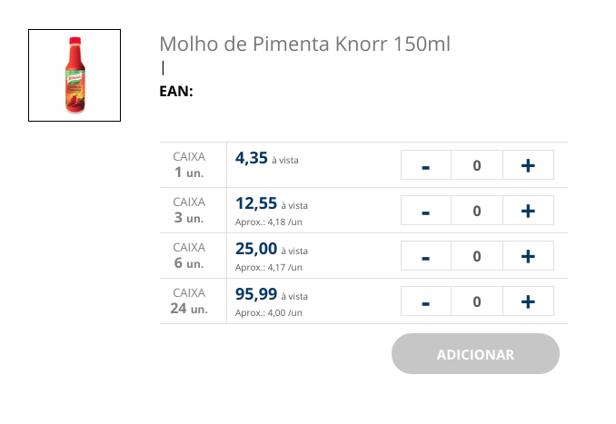
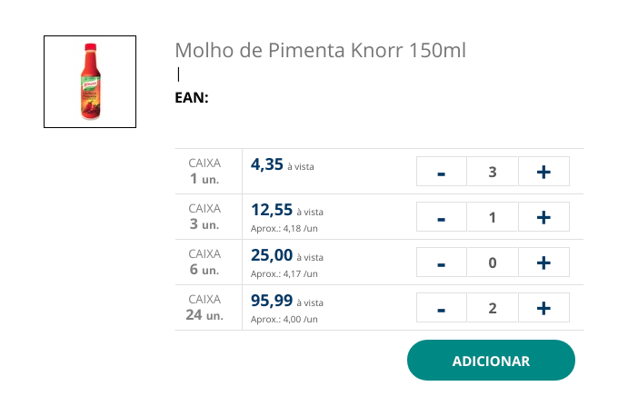
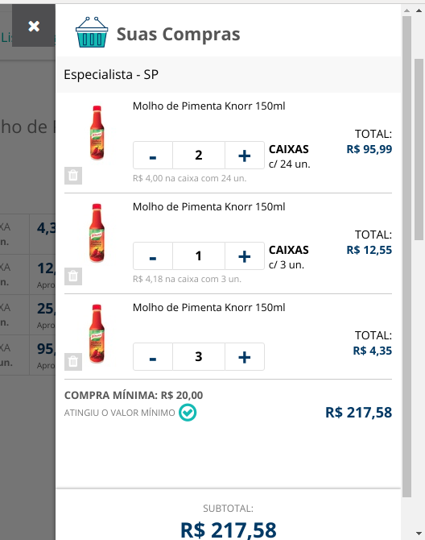

# Agrupamento de Produtos

## O que é um agrupamento de produtos?
Agrupamento de produtos é a variação de um  mesmo produto, por exemplo caixas com 24 itens do produto agrupado em um mesmo item do catálogo 

 ### Catálogo exibição de produtos com variação

## Benefícios
É possível adicionar/alterar a quantidade no catalogo as variações do produto e quando adicionado no carrinho ele atualizará com a quantidade escolhida na catálogo
### Catálogo exibição com quantidade
   

### Carrinho flutuante com todas quantidades adicionadas 
 

 ## Mudanças importantes
Devido o catálogo conter uma semelhança do itens do carrinho, será possível enviar a quantidade 0 *(zero)* para o carrinho, fazendo que se o produto já existir no carrinho ele será removido, caso não tenho, não irá fazer nada. 
Para esse comportamento funcionar será necessário ativar a GP 'CKOUT_FORCE_SEND_ZERO_TO_CART'
mais informações de GP aqui em 

## GeneralConfigs

    CKOUT_FORCE_SEND_ZERO_TO_CART

| **Ligada** (true)| **Desligada** (false)
|---------|---------|
|Permite enviar a quantidade 0(zero) para o carrinho, caso tenha o produto no carrinho é retirado, se não tiver nada é feito.|(Comportamento padrão):  Ao enviar a quantidade 0 (zero) para o carrinho, caso tenha o produto é retirado, caso não tenha é adicionado a quantidade 1.

## Alterar Variável Default para o resultado de regra no componente

É possível usar uma variável opcional, caso não queira usar a padrão do componente.

**Exemplo category.xhtml**

veja a seguir  a  variável **skuVariableName="skuVariation"** será a variável opcional passada para o componente

~~~html

   <acec:component name="shelf-item-name" skuVariableName="skuVariation" rule="dummy"/>

~~~

No componente **[shelf-item-name]**
~~~html
<h:outputText value="${#%skuVariation|sku#%.sellingTitle}"/>
~~~

Usando **#%skuVariation|sku#%.sellingTitle** quando o componente houver o parâmetro **skuVariableName="skuVariation"** na inserção do componente desejado (neste caso shelf-item-name) ele deixara de usar o sku e passará a utilizar o valor do parâmetro **skuVariation**.

Resultado gerado quando é passado o skuVariation:
~~~html
<h:outputText value="${skuVariation.sellingTitle}"/>
~~~
 
### Sem utilizando a variável opcional
~~~html
<acec:component name="shelf-item-name" rule="dummy"/>
~~~
Resultado quando não é passado o skuVariation
~~~html
<h:outputText value="${sku.sellingTitle}"/>
 ~~~
 

