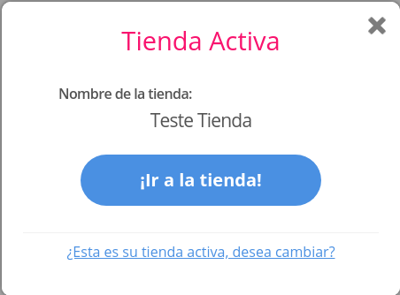
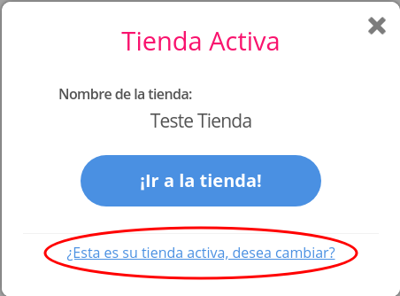
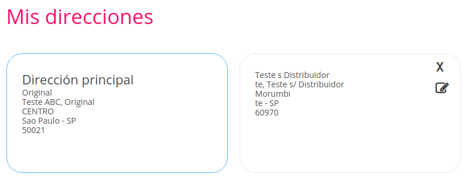
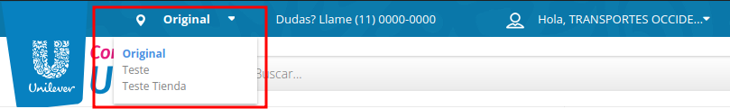
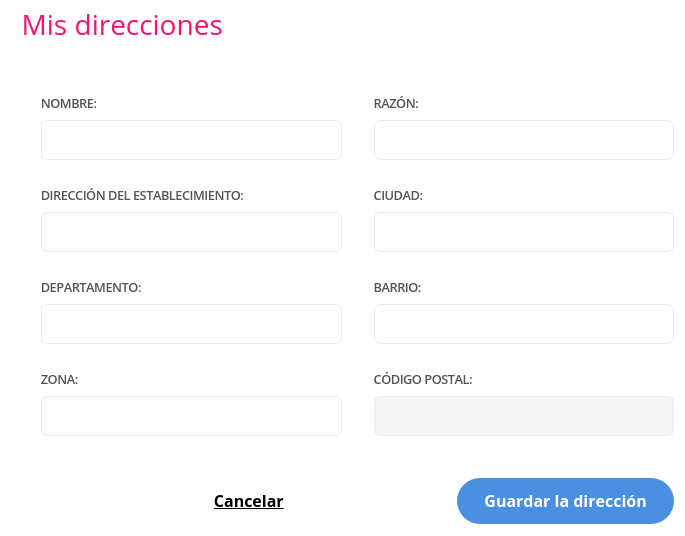
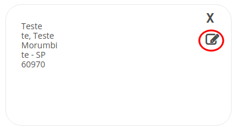
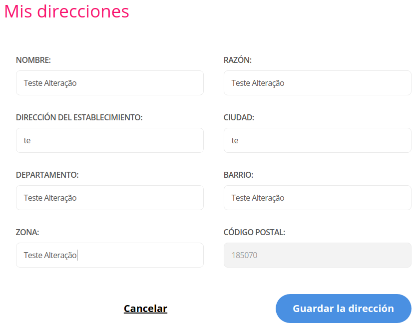
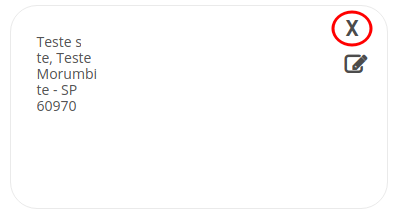
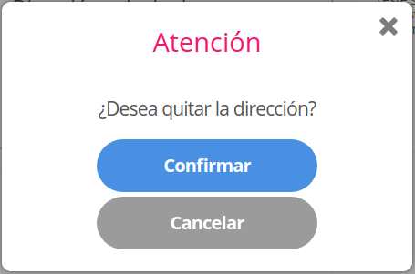
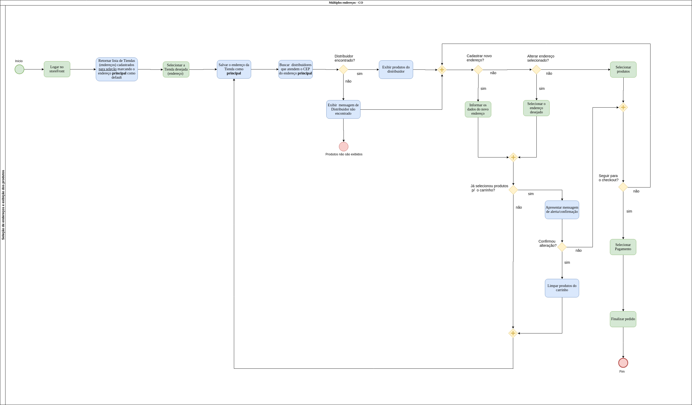

# Múltiplos Endereços

# Definição
Múltiplos endereços tem como propósito possibilitar criação, edição e remoção de endereços de clientes nas lojas B2B.
Bem como disponibilizar uma interface amigável e intuitiva para isso.

# Detalhamento Técnico
Para maiores detalhes técnicos para implementaçao da funcionalidade de multiplos endereços:
* [Incluir Funcionalidade](incluir-funcionalidade/README.md)

# Exibição de Tienda Activa 
Após a autenticação do usuário será exibido um modal informando qual o endereço que está configurado como o principal. Neste modal será possivel seguir para a tela principal do Ckout ou ser direcionado para tela de *"Mis direcciones"*.



# Selecionar endereço principal. 
Esse fluxo pode ser iniciado de três maneiras:
1. Link disponibilizado no model *"Tienda Activa"*


2. Tela "*Mis direcciones*"


3. *Combobox* exibido no *header* da aplicação.



Para selecionar um endereço como principal basta clicar no endereço desejado. Após isso será exibido um modal de confirmação, informando que para alterar o endereço principal o carrinho será automaticamente limpo. 
Caso exista o desejo de prosseguir o carrinho será esvaziado e o endereço principal alterado.

Observações:
* Os Endereços que não possuem distribuidores não poderão ser seleciodados como principais. 
* O fluxo de seleção de endereço principal só pode ser iniciado por usuários devidamente autenticados.   

# Inclusão de novo endereço
Para realizar inclusão de um novo endereço devemos realizar a chamada de um serviço através do front.

```
ckout/api/v3/address/insert
```
A partirda chamada do serviço os endereços ficarão salvos na tabela **ECSL_ADDRESS** e possuem uma chave com a tabela **ECSL_CUSTOMER**.

Para iniciar o fluxo de cadastro de endereço deve ser acessado o menu *"Mis direcciones"* e clicar no botão *"Crear nueva dirección?"*.
Após isso o formulario para cadastro será exibido



Obs.: A forma de preenchimento automática de endereço pode variar de loja para loja ou de um país para o outro.

Por exemplo: Na Unielever Mexico, os dados são obtidos ao informar o Código Postal, de forma semelhante ao que ocorre na Unielever Brasil.

Na Unielever Colombia *Código Postal* será apresentado após o preenchimento dos campos *DIRECCIÓN DEL ESTABLECIMIENTO* e *CIUDAD*. Este campo é preenchido através de uma API do projeto Sitidata, para mais informações acesse https://gitlab.infracommerce.com.br/store-unileverco/unileverco-doc.


# Alteração de um endereço
Para realizar a alteração devemos realizar a chamada de um serviço através do front.

```
ckout/api/v3/address/update
```
A partir da chamada do serviço os endereços serão atualizados na tabela **ECSL_ADDRESS**.

Para iniciar o fluxo de edição de endereço deve ser acessado o menu *"Mis direcciones"* e clicar no botão *"Editar?"*.





Após isso um formulário com os dados do endereço selecionado será exibido e os dados poderão ser editados.


# Remoção de um endereço
Para realizar a remoção devemos chaar um serviço através do front.

```
ckout/api/v3/address/remove
```
A partir da chamada do serviço o endereço selecionado será removido da tabela **ECSL_ADDRESS**.

Para iniciar o fluxo de remoção de endereço deve ser acessado o menu *"Mis direcciones"*, clicar no botão *"Remover?"* e confirmar o interesse em remoção.




Após confirmação o mesmo será removido da lista endereços. 

# Fluxograma
