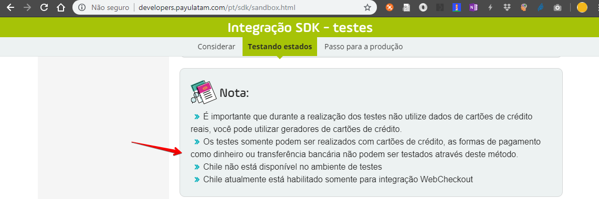
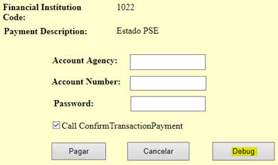
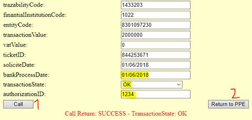

# PSE (Pago Seguro En línea)

O PSE (Pago Seguro En línea) é um meio de pagamento utilizado na Colômbia que basicamente faz o débito na conta corrente do cliente.

Ao selecionar esse meio de pagamento o usuário é redirecionado para uma página do seu próprio banco onde ele realiza a autorização do débito.

Esse pagamento é utilizado somente na Colômbia e o gateway utilizado para processar esse meio de pagamento é a **PayU**.

## Configuração no Ckout

A configuração desse meio de pagamento no **PaymentRulesSample.drl** deve ser feita da seguinte maneira:

```java
...
} else if (paymentKey.equals("PSE")) {
    po.setPaymentKey("PSE");
    po.setPaymentType("DEBIT");
    po.setPaymentName(customPaymentName != null ? customPaymentName : "PSE");
    po.setQttDueDate(30);
    po.setDescription("Débito em conta, a vista"); 
    po.setImageUrl("images/pgto-img-boleto.jpg");
    po.getProperties().put("ORDER_PAYMENT_TYPE", "5");  
    po.getProperties().put("ORDER_PAYMENT_TP_ID", "5");
    po.getProperties().put("APPROVAL_DAYS", "5");
    po.getProperties().put("GATEWAY", "PAYU");
    po.getProperties().put("ORDER_PAYMENT_KEY", "PSE");
    po.getProperties().put("PAYMENT_METHOD_PSE", "PSE");
}
...
```

## Diagrama de Sequência

Abaixo encontra-se o diagrama de sequência dos métodos executados no Ckout quando o PSE é utilizado:


## Passo a passo para testar

A documentação oficial da PayU diz que não é possível realizar testes desse meio de pagamento (http://developers.payulatam.com/pt/sdk/sandbox.html):



Contudo, existe sim uma maneira de testar esse meio de pagamento! =]

### 1 - Utilizar URL do Sandbox

Garanta que está configurada a URL do sandbox na GP `PAYU_CONFIG`:

```js
{
    ...,
    "apiendpoints": [
        {
            "endpoint": "payments-api",
            "uri": "https://sandbox.api.payulatam.com/payments-api/4.0/service.cgi",
            "connectTimeout": 6,
            "readTimeout": 60,
            "proxy": ""
        },
        {
            "endpoint": "payments-ckout",
            "uri": "https://sandbox.api.payulatam.com/payments-api/4.0/service.cg",
            "connectTimeout": 6,
            "readTimeout": 60,
            "proxy": ""
        },
        {
            "endpoint": "reports-api",
            "uri": "https://www.mocky.io/v2/593b1770110000a418a958bc",
            "connectTimeout": 6,
            "readTimeout": 30,
            "proxy": ""
        },
        {
            "endpoint": "reports-api-old",
            "uri": "https://sandbox.api.payulatam.com/payments-api/4.0/service.cgi",
            "connectTimeout": 6,
            "readTimeout": 30,
            "proxy": ""
        },
        {
            "endpoint": "reports-ckout",
            "uri": "https://sandbox.api.payulatam.com/reports-api/4.0/service.cgi",
            "connectTimeout": 6,
            "readTimeout": 30,
            "proxy": ""
        },
        {
            "endpoint": "reports-api-payments-payu",
            "uri": "https://sandbox.api.payulatam.com/payments-api/",
            "connectTimeout": 6,
            "readTimeout": 30,
            "proxy": ""
        }
    ]
}
```
### 2 - test = false

A variável `test` tem que ser setada para o valor `false` para poder testar PSE.

Essa configuração também é feita na GP `PAYU_CONFIG`:

```js
{
    "test": false,
    ...
}
```

Via SDK é através do atributo: ```PayU.isTest```

### 3 - Banco Union Colombiano

No fluxo de compra deve-se selecionar o banco **BANCO UNION COLOMBIANO**.
O código PSE desse banco é: ```1022```

Os outros campos podem ser preenchidos com qualquer valor, a única restrição é que o banco selecionado seja esse.

OBS: Importante que para um novo teste seja enviado um novo Reference Code, caso contrário será acusado que já existe um pagamento.  Via SDK essa configuração é através do atributo: ```PayU.PARAMETERS.REFERENCE_CODE```

### 4 - E-mail já cadastrado na PayU

Exemplo de request para DEBUG:

```js
{payerContactPhone=7563126, country=CO, cookie=DwF38HxTJre705ibNP24V7x7o8, buyerEmail=buyer_test@test.com, ipAddress=127.0.0.1, description=payment test, payerDocumentType=CC, userAgent=Mozilla/5.0 (Windows NT 5.1; rv:18.0) Gecko/20100101 Firefox/18.0, payerPersonType=NATURAL, accountId=512321, responseUrl=http://www.test.com/response, payerDNI=123456789, payerName=First name and second payer name, paymentMethod=PSE, currency=COP, referenceCode=payment_test_00125451, value=1000, payerEmail=miguel.mahecha@payulatam.com, pseFinancialInstitutionCode=1022}
```

Após finalizar o pedido no Ckout e receber a URL da PayU deve-se acessar essa URL.

OBS: O endereço da URL pode ser recuperado do response no objeto: `extraParameters[BANK_URL]`

Ex: `BANK_URL=https://registro.desarrollo.pse.com.co/PSEUserRegister/StartTransaction.htm?enc=tnPcJHMKlSnmRpHM8fAbuwqopA1HKk2R14tAzMMA2ocv%2bCt3J4eHJ6hGD7N%2fwIuZ`

Nessa página será necessário se logar na PayU para continuar o fluxo de pagamento.

Deve-se selecionar **Persona natural** e utilizar o e-mail `miguel.mahecha@payulatam.com` pois esse e-mail já está cadastrado e habilitado a usar o PSE no sandbox.

Após esse passo você será redirecionado para a simulação da página do banco.

### 5 - Selecionar Debug

Na página que simula o banco deve-se clicar no botão **Debug**:



### 6 - Simular o estado da transação

Essa página é utilizada para simular o estado da transação.

Primeiro deve-se colocar `bankProcessDate = soliciteDate`.

Depois deve-se selecionar qual status vai ser simulado no campo `transactionState` e atribuir o respectivo código no campo `authorizationID`:

| transactionState | authorizationID |
| - | - |
| OK | 1234 |
| NOT_AUTHORIZED | 00001 |
| PENDING | 1234 |
| FAILED | 00001 |

Ex: para simular o status `OK`deve-se selecionar `transactionState = OK` e `authorizationID = 1234`:



Ao clicar em **Return to PPE** você será redirecionado para a página que foi informada no parâmetro `PayU.PARAMETERS.RESPONSE_URL`.

Depois desse ponto é possível utilizar as APIs de consulta para simular o processamento batch.