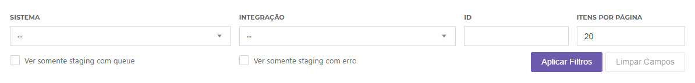
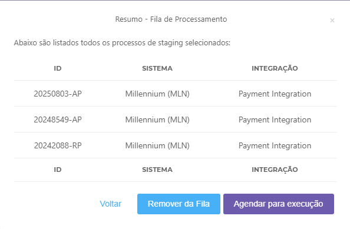
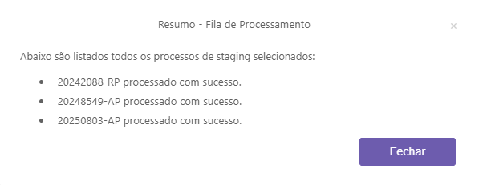

# Easy Admin - Módulo de Fila de Processamento

**URL:** [URL_ADMIN]/easyadmin/staging

**Exemplo DEV:** https://ad-mrosa-dev.infracommerce.com.br/easyadmin/staging

Tela para gerenciamento da fila de processamento, permitindo consultar, agendar/remover a execução de um processo.

## Acesso

Acesse a funcionalidade pelo menu **Acessos > Fila de Processamento**.

Para ter acesso a esta tela (leitura e escrita) é necessário possuir o perfil de acesso com as funcionalidades abaixo:

| Nome | Role | 
| ---- | ---- |
| Fila de Processamento - Gerenciar | ROLE_StageManagementQueue |
| Acessos - Stage - Gravar| ROLE_StageManagementWrite |
| Acessos - Stage - Consultar| ROLE_StageManagementRead |

Mais informações no post [Perfis de Acesso](http://infrapedia.infracommerce.com.br/shop/guia-infrashop/configuracao-de-funcionalidades/perfis-de-acesso/).

## Funcionalidade

A tela de Fila de Processamento permite `Agendar a execução` de um processo com e/ou sem queue e também `Remover a queue` de um processo existente.

Para isso a tela conta com filtros para refinar a busca, estes são:

- Sistema `obrigatório`
- Integração `obrigatório`
- ID
- Itens por Página
- Ver somente staging com queue
- Ver somente staging com erro

*Filtros da tela Fila de Processamento*

### Exibição dos Dados

Ao realizar a consulta, os dados retornados são apresentados na tabela presente abaixo dos filtros.
Na tabela são apresentados os dados:

- ID
- Sistema
- Integração
- Dados
- Status
- Agendado para

O valor da coluna Dados foi parcialmente ocultado para simplificar a visualização. Para acessar o valor completo clique sobre os dados e um conteúdo complementar será aberto contendo os resultados de Dados e Última Mensagem de Erro.

### Agendar execução / Remover da Fila

Para agendar a execução ou remover da fila um ou mais processos, selecione os processos desejados clicando na caixa de seleção da coluna Selecionar e após finalizar clique no botão `Salvar`. 
Ao clicar em salvar um pop-up de confirmação (imagem abaixo) será apresentado, contendo todos os processos selecionados.Clique na ação desejada e aguarde a finalização.

Ao terminar, um resumo da execução dos processos será apresentado ao usuário. (imagem abaixo)

