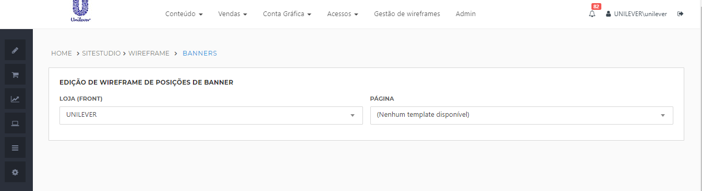

# Easy Admin - Módulo de Gestão de wireframes

**URL:** [URL_ADMIN]/easyadmin/sitestudio/wireframe/banners

**Exemplo DEV:** https://ad-mrosa-dev.infracommerce.com.br/easyadmin/sitestudio/wireframe/banners

Os wireframes definem quais posições de banners estão disponíveis em cada página da loja e auxiliam o usuário a identificar onde o banner ficará posicionado dentro da página. Ele será utilizado na página de cadastro/edição do banner quando o usuário for preencher o campo **Posição**.

:pushpin: **Importante:** O processo de cadastro de posições e templates de banner não sofre alteração, deve-se continuar seguindo o padrão atual. Apenas foi adicionado uma nova etapa no processo de criação de uma nova posição (criação dos wireframes).

A configuração do wireframe é armazenada no formato JSON em um arquivo XML. Exemplo:

```js
<bannerPositions>
{  
   "itens":[  
      {  
         "height":"250px",
         "id":"BSH",
         "name":"Banner Secundario Home",
         "width":"400",
         "pluginConfig":{  
            "x":18,
            "y":14,
            "w":18,
            "h":6
         }
      },
      {  
         "id":"BPC",
         "name":"Banner Principal da Categoria",
         "width":"300",
         "height":"200",
         "pluginConfig":{  
            "x":7,
            "y":1,
            "w":10,
            "h":10
         }
      }
   ]
}
</bannerPositions>
```

| Chave | Descrição |
| ----- | --------- |
| id | ID da posição de banner |
| name | Nome/descrição da posição |
| width | Largura |
| height | Altura |
| pluginConfig | Configuração para exibição da posição de banner no grid do wireframe |

:pushpin: **Importante:** Não podem existir 2 posições com mesmo id dentro de uma mesma página.

## Acesso

Para acessar a página de gerenciamento de wireframes acesso o menu **Gestão de Wireframes**.

Para ter acesso a esta tela (leitura e escrita) é necessário possuir o perfil de acesso com ao menos umas das funcionalidades listadas:

| Nome | Role |
| ---- | ---- |
| Site Studio - Admin | ROLE_SiteStudioAdmin |
| Site Studio - Conteúdo | ROLE_SiteStudioContent |
| Site Studio - Regras | ROLE_SiteStudioRules |
| Gestão de wireframes - Gerenciar | ROLE_WireframeManagement |

Mais informações no post [Perfis de Acesso](http://infrapedia.infracommerce.com.br/shop/guia-infrashop/configuracao-de-funcionalidades/perfis-de-acesso/).

## Funcionalidade



Caso a loja tenha mais de um store front, selecione qual você deseja alterar no campo **LOJA (FRONT)**. Depois selecione qual a página desejada no campo **PÁGINA**. Após a seleção serão listadas todas as posições existentes no wireframe atual e será exibido o grid com o "desenho" da página.


*Tabela de listagem de posições e formulário de cadastro / edição*


*Grid de posições de banner*

### Adicionar uma nova posição de banner no wireframe

Clique no botão "**Adicionar Banner**". Todos os campos são de preenchimento obrigatório. Após clique em "**Adicionar Posição**".

A nova posição de banner será adicionada a tabela de listagem, e uma nova posição será inserida no grid. Ajuste o tamanho e a posição do banner no grid.

### Editar

Clique no ícone de edição na tabela de listagem ou clique sobre o banner no grid, será exibido o formulário para edição da posição. Após finalizar a edição clique em "**Atualizar Posição**".

### Remover

Basta clicar no ícone de remover na tabela de listagem de posições.

### Salvar

:pushpin: **Importante:** Após realizar as alterações desejadas (adicionar, editar ou remover) lembre-se de clicar em "**Salvar Alterações**". Alterações que não forem salvar serão perdidas.

## Versionamento

O processo é semelhante ao que é utilizado no versionamento dos XHTMLs do catálogo.

Após realizar as alterações em todas páginas que desejar, acesse o SiteStudio da loja, publique todas as páginas (*Publish All*) e depois exporte as páginas (*Export Catalog Pages*).

Versione o conteúdo da pasta **wireframe** e o arquivo **bannerpages.json** dentro da pasta catalog/xhtml da loja.

Quando for realizar o processo de deploy de uma loja, o conteúdo dessa pasta deverá ser importado no SiteStudio novamente. 