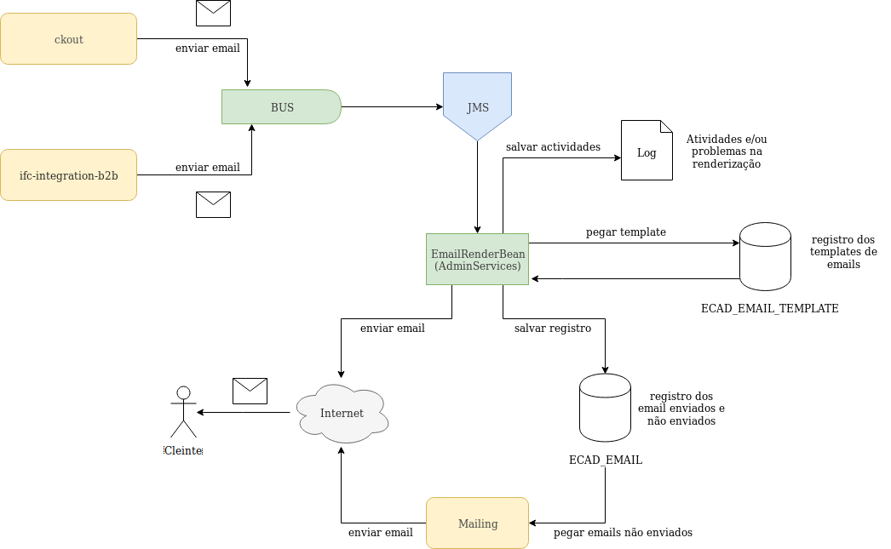
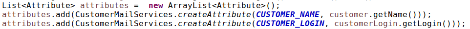
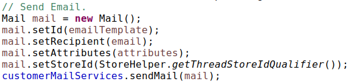
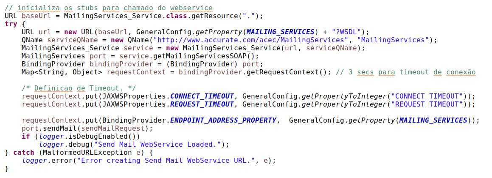
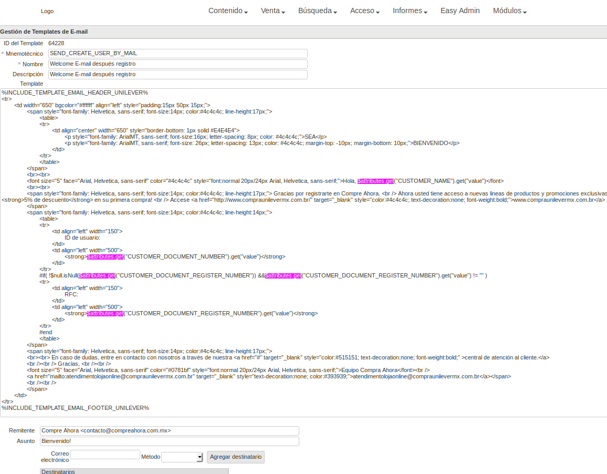

# Fluxo de Envio de Email

## Sumário
- [Conceito](#Conceito)
- [Fluxo de Envio de Email](#fluxo-de-envio-de-email-1)
- [Criação do Email](#cria%C3%A7%C3%A3o-do-email)
- [Envio do email para o BUS](#envio-do-email-para-o-bus)
- [Renderização](#renderização-arquivo-log)
- [Testar a renderização](#testar-a-renderização)

### Conceito
O envio de email é um componente fundamental no sistema para notificar aos clientes sobre diferentes atividades na sua conta. Por exemplo: 

* Email quando faz o cadatro no sistema
* Email quando um distribuidor aprova seu cadastro
* Email quando quer recuperar sua senha
* Email quando faz um pedido

### Fluxo de Envio de Email
O envio de email passa por diferentes componentes do sistema para que o email chege ao cliente final. Na figura abaixo se mostra o fluxo seguido ao se enviar um email.




Os emails são criados nos diferentes componentes do sistema, por exemplo: **ckout** ou **ifc-integration-b2b**. 

Os emails são enviados para o **BUS** do sistema, e posteriormente eles são passados para o **JMS**. 

A classe **EmailRenderBean** que fica no projeto *AdminServices* pega os mensagens do **JMS** para renderizar os emails e envia-os para o cliente. 

Na renderização, o template é recuperado do banco de dados da tabela **ECAD_EMAIL_TEMPLATE** segundo o email ID (coluna *SOURCE_NAME*) e é feito o merge com os atributos (segundo velocity) enviados junto com o email. 

Se a renderização é efetuada com sucesso, o html renderizado é salvo na tabela **ECAD_EMAIL** e o email é enviado para o cliente.

Se ocorrer um erro na renderização, ele é registrado no arquivo log __*{server name}-adm.log*__ no servidor que roda *AdminServices* e não é salvo nenhum registro na tabela **ECAD_EMAIL**.

Se o email é enviado com sucesso o registro na tabela **ECAD_EMAIL** tem o valor de 1 na coluna *STATUS*.

Se ocorrer um error no envio do email, a coluna *STATUS* tem o valor de 0.

O componente **Mailing** procura pelos registros com *STATUS*=0 na tabela **ECAD_EMAIL** para tentar enviar o email novamente até atingir o numero maximo de envios.

### Criação do Email
Os email são criados através de "[**Velocity**](http://velocity.apache.org/engine/1.7/user-guide.html)", Velocity é um motor que pega um template em HTML que contem certas marcações que posteriormente são sustituidas pelos valores de atributos que são enviados junto com o template no momento da renderização.

A criaçao de um email é muito simples, ela requere os seguintes dados para que funcione corretamente:

* ID do Email: [Id do template](https://gitlab.infracommerce.com.br/infrashop/knowledge-base/tree/general-parameter-creation/emails) a ser renderizado no envio do email.
* Destinatarios: Lista de email
* Atributos: Atributos que serão usados no template durante a renderização
* Store Id





### Envio do email para o BUS
O envio do email para o *BUS* é feito através de un serviço SOAP.



Para enviar o email para o **BUS** desde a aplicação local é necessario adicionar no hosts:

> 172.18.8.8 bus-{id-da-loja}-dev.infracommerce.com.br


### Renderização (arquivo log)
Para acompanhar a renderização do email é possivél olhar no arquivo log no servidor que roda o *AdminServices*. Para conseguir acessar desde local ao servidor do ambiente DEV é só adicionar no hosts:

> 172.18.8.46 comp300.acc.br

Para checar o log no ambiente DEV basta com usar o comando *tail* 

> tail -f /domains/app/wls/nc_e_ad/cluster3/AdminServices/logs/nc_e3c3001-adm.log

### Testar a renderização
A renderização do email pode ser testada através do SoapUI ou Postman.

> SoapUI: [svn/acc/acec/automated-testing/SoapUi/integracao/projects/MailingServices-soapui-project.xml](https://lab.accurate.com.br/svn/acc/acec/automated-testing/SoapUi/integracao/projects/MailingServices-soapui-project.xml)

> Postman: [svn/acc/acec/automated-testing/Postman/domain/Email.postman_collection.json](https://lab.accurate.com.br/svn/acc/acec/automated-testing/Postman/domain/Email.postman_collection.json)

Basta só importar os projetos no SoapUI ou Postman.

Para testar é necessario enviar os [parametros requeridos](#cria%C3%A7%C3%A3o-do-email) para a criação do email (ID do email, destinatarios, atributos e ID da loja) no body da request:

```xml
<S:Envelope xmlns:S="http://schemas.xmlsoap.org/soap/envelope/">
   <S:Header/>
   <S:Body>
      <ns2:sendMailRequest xmlns="http://www.accurate.com/acec/mailing" xmlns:ns2="http://www.accurate.com/acec/MailingServices">
         <ns2:mailList>
            <mail>
               <id>{EMAIL_TEMPLATE_ID}</id>
               <recipient>{RECIPIENT_LIST}</recipient>
               <attributes>
                  <attribute>
                     <key>{ATRIBUTE_KEY}</key>
                     <value>{ATTRIBUTE_VALUE}</value>
                  </attribute>
                  <attribute>
                     <key>{ATRIBUTE_KEY}</key>
                     <value>{ATTRIBUTE_VALUE}</value>
                  </attribute>
                  <attribute>
                     <key>{ATRIBUTE_KEY}</key>
                     <value>{ATTRIBUTE_VALUE}</value>
                  </attribute>
               </attributes>
               <storeId>{STORE_ID}</storeId>
            </mail>
         </ns2:mailList>
      </ns2:sendMailRequest>
   </S:Body>
</S:Envelope>
```


Para saber quais atributos são requeridos, pode-se olhar no template do email (tabela **ECAD_EMAIL_TEMPLATE**) ou no admin do site da loja e procurar pelos atributos usados nele (buscar pelo texto "__*$attributes.get*__") .



Quando a chamada estiver em formato correto o retorno de sucesso será:

```xml
<?xml version="1.0" encoding="UTF-8"?>
<soapenv:Envelope xmlns:soapenv="http://schemas.xmlsoap.org/soap/envelope/">
    <S:Header xmlns:S="http://schemas.xmlsoap.org/soap/envelope/"/>
    <S:Body xmlns:S="http://schemas.xmlsoap.org/soap/envelope/">
        <mail:sendMailResponse xmlns:mail="http://www.accurate.com/acec/MailingServices"/>
    </S:Body>
</soapenv:Envelope>
```