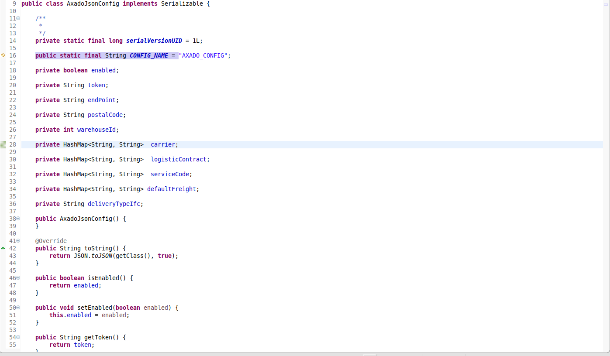

# General Parameter


## Conceito

Toda vez que uma funcionalidade dever apresentar um comportamento específico para uma ou mais lojas, que não é padrão para o restante, esse comportamente deve ser gerido por meio de um General Parameter.
Assim, um General Parameter se subentende por uma configuração especial para cada loja, no qual é determinado como cada funcionalidade do sistema deve ser moldada para atender à uma necessidade específica dessa loja (ou mais).

Exemplo de Caso de Uso:
* O sistema possui uma funcionalidade de cadastro de clientes, e ela funcionará igualmente para todas as lojas.
* Se mostra necessário que as lojas de uma região específica tenha uma chamada a mais de validação para números telefônicos
* É criado então um General Parameter para todas as lojas para determinar se elas irão ou não utilizar essa chamada de validação
* No código, é adicionado uma condição para checar se a chamada deve ou não ser chamada a partir do General Parameter.


## Usabilidade
Os General Parameters podem conter qualquer tipo de valor, seja ele uma simples flag ou uma lista inteira de valores. É possível até mesmo armazenamento de Json.
Isso deve ser definido de acordo com a necessidade da funcionalidade à ser implementada. Confira abaixo as diferentes possibilidades:

### 1-Valor Único
No exemplo abaixo, temos alguns General Parameters configurados no formato de valor único. Nesse caso a coluna VALUE_TYPE será 'S' de String. 
Essa opção é usada para armazenagem de dados sólidos (que não possuem alternativas) como links, urls, regex, valores numéricos, etc.


### 2-Lista de Valores
No exemplo abaixo, temos alguns General Parameters configurados no formato de lista de valores. Nesse caso a coluna VALUE_TYPE será 'L' de List.
Essa opção é usada quando o valor do General Parameter é volátil e todas as possíveis opções já estão mapeadas, como por exemplo opções binárias (verdadeiro/falso, sim/não, etc), opções preestabelecidas, opções de idiomas, etc. Para essa usabilidade, será utilizada a coluna VALUE do banco de dados para conter a opção atual vigente para a loja, e a coluna VALUE_LIST do banco de dados para conter todas as opções possíveis, usando um pipe ("|") para separar as opções e uma cerquilha ("#") para adicionar descrições à cada opção. 


    
Caso seja necessário, para alterar um valor de uma lista de valores, é possível usar o Admin. Entrando no menu "Acesso" -> "Parâmetros" e buscando pelo General Parameter que deseja editar, o sistema irá dispor a lista completa de opções que foram cadastradas no banco de dados. Basta um clique para alterar a opção. 


### 3-JSon
No exemplo abaixo temos alguns General Parameters configurados no formato de Json. Nesse caso a coluna VALUE_TYPE será 'J' de Json. Esse tipo é usado para guardar estruturas mais complexas, onde se faz necessário armazenar mais valores, agrupados por parametros. A coluna value, portanto, terá o formato de Json.


Para receber essa estrutura no código, é possível criar uma entidade java com atributos compatíveis aos parâmetros do Json, uma vez que tenham o mesmo nome. É possível armazenar qualquer variável, inclusive Listas e Hashmaps. Para que a serialização se faça correta, entretanto, é necessário que a classe seja declarada com uma String estática chamada "CONFIG_NAME" que deve conter o nome da General Parameter conforme o banco de dados.



## Parâmetro Global
Os General Parameters Globais são parametrizações da plataforma, que se aplicam automaticamente para todas as lojas.
São usadas, na maioria dos casos, para definições que variam de ambiente para ambiente como, por exemplo, informações de acesso à bancos, índices, urls, etc. 
Esses parâmetros representavam dados de configuração que são acessíveis por qualquer parte do sistema, sem distinção algum entre as lojas.
Os Parâmetros globais ainda estão sujeitos à tipagem aplicada aos Parâmetros Gerais explicados na sessão anterior, sendo portanto possível a separação em String, Lista de Valores e Json. 

Esses parâmetros possuirão na coluna STORE_ID o valor "GLOBAL", ao invés de uma loja. 


## Acesso Em Nível de Código
Os General Parameter são acessíveis via código por meio do objeto estático da classe GeneralConfig, que estará visivel de qualquer parte do sistema. Essa classe conta com diversos métodos usados para recuperar os valores do parâmetros salvos no banco. 

Observe abaixo os exemplos de uso desses métodos:

>### GeneralConfig.getProperty("{general_parameter_id}")
>Retorna pontualmente o valor do Parâmetro em formato String
>
>

>### GeneralConfig.getPropertyToBoolean("{general_parameter_id}")
>Recupera os dados em formato Boolean
>
>

>### GeneralConfig.getJsonProperty("{classe_criada.class}")
>Retorna o valor do parâmetro em JSon em uma instância da classe criada para armazená-lo (vide exemplo de usabilidade de Json acima nesse guia)
>
>

>### GeneralConfig.getJsonPropertyAttribute("{general_parameter_id}, {attribute_name}") || GeneralConfig.getJsonPropertyAttributeToBoolean("{general_parameter_id}, {attribute_name}")
>Recupera apenas um campo do Json diretamente em uma variável String ou Boolean
>
>

>### GeneralConfig.getGlobalProperty("{general_parameter_id}") ||  GeneralConfig.getGlobalJsonProperty("{classe_criada.class}")
>Recupera o valor de parâmetros globais, sejam eles únicos ou em JSON
>
>

## Criação e Atualização em Massa de General Parameters

A criação de novos General Parameters se faz necessária toda vez que um novo comportamento exigir uma particularidade em uma loja que será diferente das demais. Esse parâmetro é essencial para evitar que seja necessário distinguir os métodos java a partir de cada loja e, ao invés disso, criar fluxos diferentes de acordo com a configuração estabelecida para as lojas. 

A criação de General Parameter é feita pela procedure "ecad_gp_ins_upd_all_stores", que recebe os dados do General Parameter. Ela pode ser chamada usando o script de exemplo abaixo

```sql
SET SERVEROUTPUT ON;
begin
  ecad_gp_ins_upd_all_stores(
    p_gp_id => 'NOME DO GP',
    p_gp_value => 'false',
    p_gp_description => 'DESCRIÇÃO DO GP',
    p_gp_group_id => 0,
    p_gp_value_type => 'L',
    p_gp_value_list => 'true#Habilitado|false#Desabilitado',
    p_gp_update_if_exists => false
  );
END;
/
```

Preencha os valores para General Parameter Id e Description, e selecione qual será o value_type do seu General Parameter de acordo com as opções explicadas na parte superior desse guia, na sessão de Usabilidade, usando apenas seu caracter de indicação ('L', 'S' ou 'J').
Caso deseje usar a lista de valores, lembre-se de preencher o campo de value_list mantendo a sintaxe de opções com cerquilha ("#") para atribuir a label e pipeline ("|") para separar as opções. 

*Se sua estiver criando um novo General Parameter, lembre-se que é mais simples criá-la com os valores padrão, e atualizar em seguida apenas a(s) loja(s) que terão comportamente distinto. 

A procedure, então, varrerá a base e encontrará todas as lojas cadastradas. Em seguida, ela itera as lojas, e insere o parâmetro para todas as lojas onde ele não existir. 

Caso já exista, a procedure irá atualizar o registro já existente para se igualar aos inseridos OU irá ignorá-lo e mantê-lo como está. Isso é controlado pelo atributo "p_gp_update_if_exists", que é passado pelo script, portanto você deve alterar o valor desse atributo de acordo com sua vontade:

Uma vez que tenha preenchido todos os valores, rode esse script no banco de dados ECAD e os General Parameters serão criados para todas as lojas. Atualize, então, os valores que desejar diferenciar do restante em seguida Comite suas mudanças para persisti-las no banco.  
