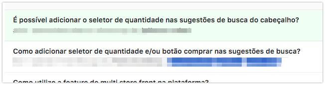
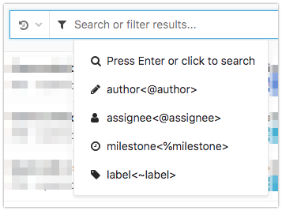
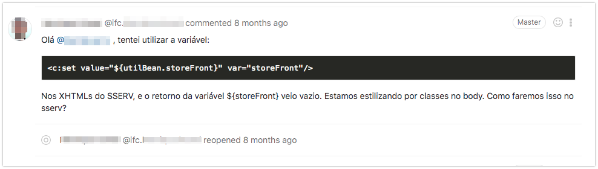
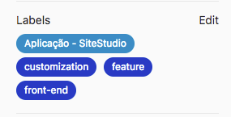
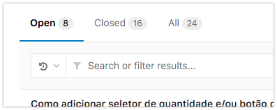

# Issues

[> Acessar Issues <] (https://gitlab.infracommerce.com.br/infrashop/knowledge-base/issues)

# Como deve funcionar

Se você tem uma dúvida de como realizar, criar, ou como funciona algo, vamos criar uma "issue" no projeto. Quando alguém puder responder ou quando você souber a resposta, volta na "issue", altera a descrição da "issue" e complementa com as respostas, imagens ou o que for necessário para expressar o conhecimento.

Podem ser criadas perguntas mesmo sem respostas. As respostas podem ir surgindo conforme formos utilizando esse modelo na ferramenta.

A resposta pode ser um link para a documentação, uma frase, explicação. Ou até mesmo podem existir mais de uma pergunta, escrita de forma diferente que acabe tendo como resposta o link para a mesma documentação.

O importante é as palavras poderem ajudar no resultado ao utilizarmos campos de busca neste projeto.

Por ser uma "issue" podemos "discutir" nos comentários, afim de melhorar a pergunta ou até mesmo a resposta.

Adicionalmente, podemos criar tags para facilitar filtros dentro da busca.

E após termos a resposta realizada, podemos fechar a "issue" e assim temos filtros de "issues" abertas em que todos podem participar com o conhecimento que possuem.

Entre outras vantagens que, todos utilizando, podemos melhorar.
O intuito é termos um local para pesquisar e encontrar as informações de forma masi clara e rápida.