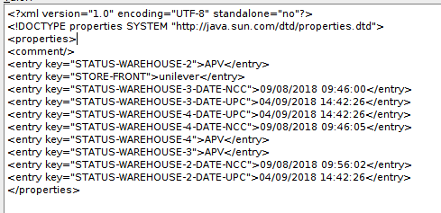

# InfraShop - Store Front

## Sumário
- [Store Front](#store-front)

### Store Front
A propriedade storeFront foi implementada para o caso de um *STORE_ID* ter mais de uma loja, como por exemplo a **UNILEVER** possui a loja **Compra Unilever** e **Compra Food Service**. Apesar dessas duas lojas serem da **UNILEVER** elas possuem layout, produtos, preços e regras de negócios distintas, porém o fluxo interno é o mesmo, então foi criado o atributo storeFront para diferencia-las. O valor desse atributo é salvo automaticamente na tabela **ECSL_CUSTOMER**  a partir do site em que o cliente está efetuando o cadastro. Nessa tabela existe o campo **CUSTOMER_ATTRIBUTES_XML** que contém as informações dos distribuidores que atendem a região do cliente e também o valor do storeFront, como podemos ver na imagem a seguir.

Para uma visão geral sobre store fronts:
*  https://gitlab.infracommerce.com.br/infrashop/knowledge-base/issues/16

[[⬆︎ Topo]](#sumário)
